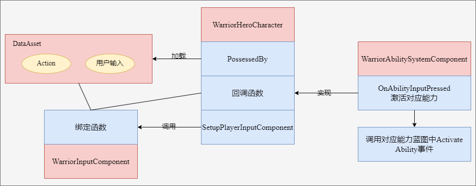
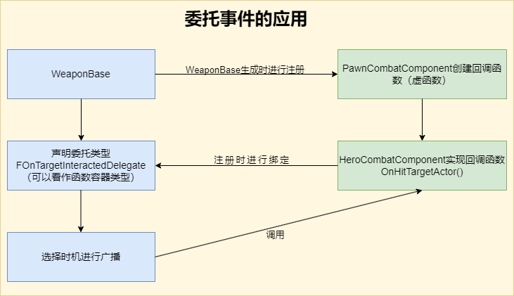
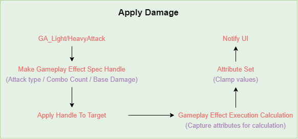

# Warrior

## Melee Combo System

  
Lesson list

  

  

    
### 3-5 Hero Hero Gameplay Ability

  

    
> 本节主要内容是在以下两个文件中创建辅助函数（查找角色、控制器、组件等），以供蓝图调用
> - WarriorGameplayAbility
> - WarriorHeroGameplayAbility
  

  

    
### 3-6 Ability Input Action

   

  
> 本节课主要是重复了Input Binding流程的前三个流程
> 
>> 全流程：Native Gameplay Tags -> Input Config Data Asset -> Custom Input Component -> Binding Inputs -> Assign Assets in Editor
>
> Native Gameplay Tags: 声明及定义GameplayTag
> 
> Input Cofig Data Asset: 创建了一个新的数组存储AbilityInputAction
> 
> Custome Input Component: 为绑定action创建了模板函数

  

    
### 3-7 Hero Ability Set

  

> Hero Character需要把标签传给Ablity System Component，通过标签激活对应的Ability，因此在UDataAsset_HeroStartUpData类里创建了一个结构体，维护标签与ability的关系，并重写了将能力赋予ASC的方法，这样在WarriorHeroCharacter的PossessedBy函数中就会调用子类的GiveToAbilitySystemComponent方法。

  

    
### 3-8 Binding Ability Input

  

  
> 在Input Component中将Ability与tag绑定，在Hero Character中，调用绑定方法并定义回调函数，回调函数负责触发技能。

  

    
### 3-10 Wait for Gameplay Event

  

  
> 这两节课主要是创建动画，创建了动画通知用的蓝图，传递标签，并定义了新的标签，供发送通知时使用。（标签主要是用来识别武器的）

  

    
### 3-13 Link Anim Layer

  

  
> 不同的武器会有不同的动画，为了避免创建复杂的动画图表，采用了分层的概念创建动画。

  

    
### 3-14 Default Weapon Ability

  

  
> 设置了能力蓝图中，能力标签对其他标签的屏蔽。
> 
> 角色在装备武器时，要链接动画图层，有不同的能力：卸下装备，轻攻击，重攻击等，重新绑定输入映射上下文。
> 
> 角色在卸下装备时，需要卸载动画图层，移除授予的能力，移除输入映射等。
> 
> 这些跟武器相关，所以将这些内容维护在AWarriorHeroWeapon类中，简而言之，我们在捡起武器的同时，也捡起了一套“系统”。

  

    
### 3-15 Grant Weapon Ability

  

  
> UWarriorAbilitySystemComponent类里添加了GrantHeroWeaponAbilities方法，根据武器关联的能力进行授予。
>
> 设置蓝图。
>
> （不知道为什么少了3-14节的几个资源，已补充）

  

    
### 3-16 Handle Unequip Axe

  

  
> 卸载武器时，需要unlinke anim class layers，删除mapping context以及清空授权的能力。
>
> UWarriorAbilitySystemComponent负责授权能力以及移除授权能力，已授权的FGameplayAbilitySpecHandle被保存在武器类中。
>
> 补充了3-15结尾遗留部分代码。

  

    
### Stop & Summarize

  

  
> 前面这部分主要内容是围绕着输入-技能展开的，抛开动画暂且不论，仅输入-技能而言，大概逻辑是mapping context将action与input tag对应起来，而mapping context被存储在data asset中；input component中定义了绑定函数，将action，tag与回调函数进行关联，hero character的possesedby函数加载data asset，setupplayerinputcomponent中则启用了input component中的绑定函数，回调函数也在hero character中被定义，但其真正的实现OnAbilityInputPressed则在WarriorAbilitySystemComponent中，该函数根据标签遍历可激活的技能列表（GetActivatableAbilities()返回的是【可激活】的技能，可激活也就是被授予的技能，区别于【已激活】），如果标签匹配则激活对应技能TryActivateAbility，此时会触发对应蓝图中Activate Ability事件，执行后续逻辑，比如播放montage，设置anim class layer，mapping context，授予能力等等。
> 
  

  

### 3-17 Light Attack Ability

  

>讲解了轻攻击能力的配置流程，前面框架搭好以后，流程就是：
>
>定义tag -> 创建action -> Input config中将input tag与action绑定 -> 修改mapping context，将aciton与输入进行映射 -> 创建能力蓝图，设置标签 -> 在武器中修改weapon data，配置input tag与ability
>
>注意：能力蓝图中设置的是ability tag，而其他地方没有记错的话设置的是input tag，Weapon data中将input tag与能力蓝图绑定，也就与ability tag进行了关联。

### 3-18 Combo Logic

> 本节重点是在GA_Hero_LightAttackMaster中创建了连击的逻辑，连续攻击增加计数，超过一定时间进行重置。
> 
> GA_Hero_LightAttack_Axe中则维护了montage的映射。
>
> 注意，montage中的slot可以视作一个“动画播放通道”，以控制不同部位的动画。

### 3-20 Heavy Attack Logic

> 本节与上一节的内容同轻攻击。
  

### 3-21 Warrior Function Library

> 因为连击系统与动画是独立的，现在需要实现这样的功能：轻击3之后可以直接跳转到重击2，就需要进行通信。
>
> 本节创建了一个函数库以供后续使用，比如获取ASC组件，添加标签，移除标签，检测actor是否有标签等。
  

### 3-22 Jump To Finisher
  

> 在轻击和重击的功能蓝图中进行了轻击3->重击2的功能实现，主要思路就是通过Ability System Component添加标签，以识别能否进行跳转。
  

### 3-23 Slow Motion and Sound FX
  

> 基于AnimNotifyState类创建蓝图，重载函数以控制时间流速。
>
> 给montage添加慢动作及音效。
  

### Bug Fixed
  

> 上一节重击1的montage未保存。
>
> 修理了几处bug：之前定义event.unequip.axe标签时多打了空格，修复后导致人物不能正常收回武器，需要在收回武器的能力蓝图和montage中重新选择标签。

### 3-24 Section Wrap Up
  

> 注释调试代码，在FWarriorHeroAbilitySet这个结构体中，AbilityToGrant的类型换为更具体的子类UWarriorHeroGameplayAbility，删除部分无用资源。

## Hero Combat

  
Lesson list

### 4-3 Set Up Enemy Character
  

> 前期准备，创建Enemy的C++类：character，startup data，gameplay ability，combat component。

### 4-4 Gruntling Guardian
  

> 创建动画蓝图，在创建模板动画蓝图的时候，并不需要指定骨骼。

### 4-5 Asynchronous Loading
  

> 主角因为只有一个，在加载start up data的时候是同步加载的，及时阻塞游戏进程，也很快就加载完了；而敌人数量可能是不定的，所以本节采用了异步加载的方式，在进行异步加载的时候还应用了lambda函数。
>
> 回顾一下start up data，该类主要是为了存储ablity而存在的，我们加载start up data也是为了授予主角/敌人能力的，注意，授予能力 ！= 激活能力。

### 4-6 Spawn Enemy Weapon
  

> 给敌人生成武器，创建游戏能力蓝图BP_Guardian_SpawnWeapon，需要设置tag，创建武器类，设置socket等。

### 4-7 Attribute Set
  

> 给角色设置血量，攻击力等属性。通过宏创建辅助函数。
>
> 点击~，在控制台输入showdebug abilitysystem后会显示设置的属性。

### 4-8 Gameplay Effect
  

> 上一节设置了AttributeSet，而Gameplay Effect的作用则是修改属性值。
>
> 本节同时也建立了Curve Table，有点类似于Excel表格填表。

### 4-9 Apply Gameplay Effect To Self
  

> 创建好Gameplay Effect以后，下一步就是怎么应用的问题，首先在UDataAsset_StartUpDataBase中保存UGameplayEffect，之后在GiveToAbilitySystemComponent函数中应用Gameplay Effect。
>
> 注意在DA_Hero中，给StartUpGameplayEffects进行赋值时，有先后顺序，先是MaxHealth，再是CurrentHealth。

### 4-10 Init Enemy Attributes
  

> 跟角色设置属性以及Gameplay Effect的流程差不多，在控制台输出调试信息的时候page down切换到敌人身上，也没有正确显示，于是修改了DefaultGame.ini文件。

### 4-11 Pawn Combat Interface
  

> 为了做伤害检测，首先需要处理武器的碰撞，而碰撞实际跟动画有关，需要设置ANS_ToggleWeaponCollision，因为AnimNotifyState有明确的起止点，以便启用/禁用武器碰撞。
>
> 为了能够启用武器碰撞，首先要获取武器，而武器可以在PawnCombatComponent中被获取，所以可以在PawnCombatComponent中设置一个ToggleCollision函数。
>
> 那么问题是怎么获取PawnCombatComponent？我们可以访问的是HeroCombatComponent/EnemyCombatComponent，对于启用/禁用碰撞而言，我们只需要访问基类PawnCombatComponent即可。
>
>> 1.用FindComponentByClass()获取组件。
>> 
>> 2.BaseCharacter实现自定义的IPawnCombatInterface接口，该接口中只有一个纯虚函数GetPawnCombatComponent()，HeroCharacter/EnemyCharacter需要覆盖虚函数并返回自己的CombatComponent。

### 4-12 Toggle Weapon Collision
  

> 在PawnCombatComponent中创建ToggleWeaponCollision以启用/禁用碰撞，在AnimNotifyState类中进行调用，并在montage中确定AnimNotifyState的起止点。

### 4-13 On Weapon Begin Overlap
  

> 本节主要内容为hit流程，在WeaponBase类有WeaponCollisionBox，将BeginOverlap与EndOverlap与WeaponCollisionBox进行绑定，对碰撞的物体进行检测。
>
> UPawnCombatComponent则用来处理武器碰撞，创建ToggleWeaponCollision函数待完善。

### 4-14 On Target Interacted
  

> 声明委托类型，在进行碰撞时或者碰撞结束后，调用委托绑定的回调函数。
>
> 

### 4-15 Notify Melee Hit
  

> 确保每次攻击时，只攻击一次：在PawnCombatComponent创建一个AAcotr*数组，当检测到对象时加入数组，之后如果再次检测到同一个actor，则直接跳过。
>
> 检测到物体以后，下一步就是进行通知以便就行后续的伤害处理，HeroCombatComponent中重写了OnHitTargetActor，进行伤害检测，在此函数中调用函数UAbilitySystemBlueprintLibrary::SendGameplayEventToActor()。在GA_LightAttack中定义了WaitGameplayEvent节点负责监听（选择了同一个标签），当SendGameplayEventToActor调用以后，该事件会被激活，执行后续伤害处理流程。

### 4-16 Set Up Attack Montages
  

> 为其他轻攻击、重攻击添加ANS通知；为重攻击添加WaitGameplayEvent节点，检测事件。

### 4-17 Make Gameplay Effect Spec Handle
  

> 前面做了hit检测，后续自然就是进行伤害处理，如何通过gameplay effect影响attribute set，流程如图所示：
>
> 
>
> 本节主要是在UWarriorHeroGameplayAbility类中创建了MakeHeroDamageEffectSpecHandle函数，返回FGameplayEffectSpecHandle以供后续使用。

### 4-18 Hero Damage Info
  

> 上一节课的补充，为MakeHeroDamageEffectSpecHandle准备入参，创建Effect Class，tag，获取base damage等。

### 4-19 Apply Effect Spec Handle To Target
  

> 创建好gameplay effect spec handle以后，下一步就是将handle应用于目标：在UWarriorGameplayAbility创建了相关函数，重点是调用UAbilitySystemComponent::ApplyGameplayEffectSpecToTarget函数。

### 4-20 Capture Relevant Attributes
  

> 为了能够进行伤害计算，需要对attributes进行捕获，本节课提供了两种方式进行捕获：一种是较慢的方式，另一种则是通过宏相对而言较快的方式进行捕获。

### 4-21 Retrieve Hero Damage Info
  

> 上节课对attributes进行了捕获，这节课主要是重载UGameplayEffectExecutionCalculation下的Execute_Implementation函数，以取得attributes的值。

### 4-22 Calculate Final Damage Done
  

> 在Execute_Implementation函数中编写**伤害计算逻辑**。

### 4-23 Set Up Heavy Attacks For Damage
  

> 在蓝图中修改heavy attck的逻辑，使得gameplay effect能够作用于attributes。
>
> 至此，前面流程图中Gameplay Effect Execution Calculation环节也就结束了。

### 4-24 Modify Health Attribute
  

> 重载PostGameplayEffectExecute函数，通过Data.EvaluatedData.Attribute与其他属性进行匹配，修改对应的属性。
>
> 本节遇到一个问题就是GAMEPLAYATTRIBUTE_PROPERTY_GETTER(ClassName, PropertyName)没有生效，而其他的Getter和Setter都是正常的，应该是跟宏里面static有关。

### 4-25 Hit React Ability
  

> 从本节开始，下面几节主要做一些所谓的“打击感”。
>
> 首先是受击反馈，这也是一种ability，敌人的ability流程是：Ability Tags -> Gameplay Ability Blueprint（先创建基类蓝图，写逻辑，子类蓝图填数据） -> Anim Montage -> Grant Ability（DA里选择对应能力蓝图）。

### 4-26 Trigger Hit React Ability
  

> 之前已经授予了能力，下一步是怎么“触发”的问题，很明显，在角色进行攻击的时候触发敌人的受击动画，所以在GA_Hero_LightAttackMaster蓝图中使用了蓝图库中的方法Send Gameplay Event To Actor，此方法被调用后，触发GA_Enemy_HitReact_Base事件，从而调整敌人面向的方向以及播放蒙太奇。

### 4-27 Material Hit FX
  

> 修改重击蓝图，使得重击能够触发受击动画。
>
> 修改enemy的材质，并通过参数对enemy材质进行控制，在GA_Enemy_HitReact_Base蓝图中，在角色被击中时修改参数，从而使得enemy呈现出不同的样子。

### 4-28 Hit Pause
  

> 实现了“卡肉”效果。Hit pause也是作为主角的一种ability，实现流程与之前基本一致，而hit pause则是通过event进行触发的，enemy的受击动画，通过在蓝图中调用Send Gameplay Event To Actor进行触发，而hit pause这里则在C++中调用了SendGameplayEventToActor函数进行触发。

### 4-29 Camera Shake
  

> GA_Hero_HitPause蓝图中加入相机抖动节点，创建相机抖动蓝图。

### 4-30 Hit React Sound
  

> 在敌人的montage中添加受击音效。
>
> 为了解决同时击中多个敌人导致同时播放多个音效的问题，创建Sound Concurrency资产，控制同时播放的音效数量。

### 4-31 Gameplay Cues
  

> 斧头的击中音效不要放在montage里，因为我们想要的是只有在斧头击中目标以后才播放击中音效。
>
> 本节使用了Gameplay Cue来播放音效。

### 4-32 Enemy Death Ability
  

> Enemy Death Process：Attribute Set(Add tag to actor) → Play Death Montage(Triggered on tag added) → Death FX(Material FX / Particle FX)
>
> 本节首先完成了死亡能力的授予，与其他ability流程一样，只不过触发ability变成了通过tag触发。
>
> 在GA_Enemy_Death_Base蓝图中播放montage和执行gameplay cue播放声音。

### 4-33 BP Death Interface
  

> 解决enemy死亡以后动画恢复至idle的问题，需要停用动画，关闭碰撞等。
>
> 怎么从EndAbility调用BP_Enemy_Character_Base中的逻辑？可以选择Cast to或者使用蓝图接口，本节创建了蓝图接口以实现通信。

### 4-34 Dissolve Material FX
  

> 给enemy和enemy weapon添加死亡后慢慢消失的效果，也就是在BP_EnemyCharacter_Base中修改材质参数，缓慢溶解的过程使用timeline来实现。
>
> 之前一直不是很清楚texture, material, anim, montage, mesh, skeleton的区别，这里说一下自己的浅见：
> > texture & material: texture是基元，提供纹理信息，而material则是综合texture及算法实现的效果，比如溶解效果的实现。
> > 
> > anim & montage: 同样anim是基元，montage在anim的基础上，进行动画的逻辑控制、动画混合等。
> > 
> > mesh & skeleton: mesh是3D模型的集合结构，决定了物体的形状，而skeleton是由骨骼和关节组成的层级结构，驱动mesh变形以实现动画。

### 4-35 Dissolve Niagara FX
  

> 使用Spawn System Attached给死亡后的enemy添加粒子特效，首先在蓝图接口中将Niagara作为函数的输入，之后在蓝图中进行加载。添加完后的粒子效果有个问题，就是颜色与enemy溶解时材质的颜色不一致，所以获取enmey的材质，找到其颜色参数，赋予niagara相关参数即可。

### 4-36 Pawn UI Component
  

> 创建PawnUIComponent及其子类，创建PawnUIInterface接口，以便查找PawnUIComponent，使WarriorBaseCharacter及子类实现该接口。

### 4-37 Broadcast Value Change
  

> AttributeSet中获取UIComponent，而UIComponent中定义了**委托函数**，当属性发生变化时，AttributeSet中获取的UIComponent则会进行广播。

### 4-38 Listen For Broadcasting
  

> 创建WarriorWidgetBase基类，该类重载NativeOnInitialized函数，此函数通过IPawnUIInterface接口获得HeroUIComponent，调用BP_OnOwningHeroUIComponentInitialized函数（此函数在Widget蓝图中被重写，绑定血量修改时的事件）。
>
> 角色蓝图中添加了Widget，之后触发Widget蓝图中NativeOnInitialized函数，子类中重载了调用BP_OnOwningHeroUIComponentInitialized函数，则会对其进行调用。
>
> 注意，此时在AttributeSet中，我们通过接口进行了广播，它并不知道Widget的存在；而反观WarriorWidgetBase类，借助于基类中的蓝图接口，它的子类蓝图也只是绑定了委托事件，并不知道AttributeSet的存在。

### 4-39 Enemy Init Created Widget
  

> 与上一节的内容差不多，为enemy创建widget相关逻辑。

### 4-40 Template Widgets
  

> 创建UI模板部件。

### 4-41 Set Status Bar Fill Color
  

> 在蓝图中编写状态条的颜色逻辑。

### 4-43 Hero Overlay Widget
  

> 创建角色UI的canvas（少用，用多了影响性能），排列之前创建的模板部件。
>
> WBP_HeroOverlay蓝图中重写WarriorWidgetBase类中的BP_OnOwningHeroUIComponentInitialized函数，将委托事件赋予函数逻辑，从而在进行广播的时候修改状态条。
>
> 将创建widget作为能力蓝图赋予角色。

### 4-44 Enemy Health Widget Component
  

> 创建敌人的health bar，在AWarriorEnemyCharacter类的构造函数中创建WidgetComponent，在BeingPlay()中调用UWarriorWidgetBase类中的InitEnemyCreatedWidget函数，使得health bar实时显示enemy血量。

### 4-45 Hide Enemy Health Bar
  

> 在WBP_DefaultEnemyHealthBar蓝图中编写health bar的隐藏逻辑，比如一开始是隐藏的，一定时间后不被攻击会隐藏，血量清空后会隐藏。注意初始化的时候会调用一次OnCurrentHealthChanged_Event节点。

### 4-46 Update Weapon Icon
  

> 实现装备/卸载武器时变换图标的功能：图标作为weapon data的一种资源，在装备/卸载武器的ability中，触发广播，对应的委托事件则负责更新图标。

### 4-47 Final Tweaking
  

> 解决切换武器图标时一闪而过的白色背景问题，导致该问题发生的原因为图片是异步加载的，在加载完以前就执行了后续流程。解决方式未创建了一个手动加载资源的自定义事件（也可以采用delay的方式解决）。
>
> 调整UI显示。

  

## Enemy AI

  
Lesson list

  

### 5-3 Crowd Following Component
  

> 躲避算法分为两种：RVO Avoidance与Detour Crowd Avoidance，从表现上来看Detour Crowd Avoidance更好一些。
>
> 创建AWarriorAIController，在初始化方法中设置PathFollowingComponent为UCrowdFollowingComponent，以启用Detour Crowd Avoidance；创建敌人AI蓝图。

### 5-4 AI Perception
  

> 实现AI的perception功能，创建EnemyPerceptionComponent与AISenseConfig_Sight，设置相关属性。创建另一个新函数，以便绑定到委托事件。

### 5-5 Generic Team ID
  

> 设置TeamID以分辨不同的阵营，原理是实现IGenericTeamAgentInterface接口，重写其中函数。

### 5-6 Behavior Tree
  

> 使用行为树来控制enemy的行为逻辑，创建黑板，其中的key对应的value通过C++进行配置，OnEnemyPerceptionUpdated是绑定的委托事件，当敌人感知到actor的时候，则对key进行设置。
>
> 为了能够运行行为树，需要在AIController中重写OnPosses函数，执行Run Behavior Tree节点。

### 5-7 Configure AI Avoidance
  

> 为了拥有更好的avoidance质量，需要设置一些参数，分为两部分：
>
> > 其中一部分参数并没有暴露给蓝图，可以在C++中创建一些暴露给蓝图的变量，通过这些变量设置参数。
> > 
> > 另外一部分参数通过Project Settings - Crowd Manager来进行设置。

### 5-8 Behavior Tree Node Types
  

> 讲解了行为树中的四种节点类型：composite node, decorator node, service node, task node。
>
> 创建service node，可通过蓝图/C++实现service逻辑。

### 5-9 Observer Aborts
  

> 设置selector节点下不同分支的中止策略。

### 5-10 Orient To Target Actor
  

> 通过C++的方式编写自定义Service，父类可以选择BTService或者BTService_BlackboardBase，BTService类基本需要从头开始编写，而BTService_BlackboardBase类中有一些初始代码。
>
> 重写TickNode函数，实现enemy面向角色的功能。

### 5-11 Environment Query System
  

> 简单介绍了EQS的各种概念以及使用。

### 5-12 Custom Query Context
  

> 修复enemy同时感知角色和test pawn的问题。
>
> 通过蓝图自定义context，使得item生成在角色周围，EQS负责生成item，过滤item；在行为树中运行EQS任务，将过滤出来的点存到黑板的键值中，MoveTo节点又从中获取位置，从而控制enemy移动。

### 5-13 Toggle Strafing State
  

> 通过蓝图自定义task处理敌人的strafing状态：设置旋转，最大行走速度，添加标签等。
>
> > 注意：对于自定义蓝图的行为树节点，默认是存在于世界中的实例，意味着变量的值在不同的execution中可以被保存，只适用于蓝图，而不能适用于C++（因为没有被实例化）。

### 5-14 Calculate Direction
  

> UWarriorCharacterAnimInstance类中声明了新的变量LocomotionDirection，并在NativeThreadSafeUpdateAnimation函数中进行更新。在ABP_Enemy_Base中引入该变量，同时声明一个新的blend space变量，通过该变量控制blend space动画的播放效果。（主要是展示了C++中变量与blend space的配合）

### 5-15 Strafing Blend Space
  

> 创建enemy的blend space，通过horizontal axis和vertical axis两个轴变量来控制动画表现。

### 5-16 Compute Success Chance
  

> 通过蓝图自定义行为树中的装饰器节点，以计算敌人有多大的概率发起攻击。

### 5-17 Dot Product Test
  

> 敌人在选择位置的时候，周围生成的点都是可选的，想要过滤掉敌人前方的一些点：原理上点积可以比较两个向量之间的角度，所以在EQS查询中增加了Dot测试以进行过滤。

### 5-18 Enemy Melee Ability
  

> 授予敌人ability的流程：创建ability基类蓝图 -> 创建ability子类蓝图 -> 配置DA_Guardian。

### 5-19 Activate Ability By Tag
  

> 激活enemy能力：
>
> > 1.在UWarriorAbilitySystemComponent类中定义函数TryActivateAbilityByTag，通过标签激活能力。
> >
> > 2.创建BTTask_ActivateAbilityByTag蓝图，重写父类蓝图中定义的OnEnemyExecuteTask函数，获取ability system component，调用定义的TryActivateAbilityByTag函数，以激活能力。
> >
> > 3.在行为树中执行该任务（行为树需要配置给AI Controller）。

### 5-20 Is Target Pawn Hostile

> 给montage添加notify state，使得武器碰撞到角色时启用碰撞。
>
> 判断是否为地图pawn，UWarriorFunctionLibrary类中创建函数IsTargetPawnHostile，通过GenericTeamId判断是否为敌对。
>
> UEnemyCombatComponent类中重写OnHitTargetActor委托函数。

### 5-21 Notify Melee Hit

> 重写OnHitTargetActor，避免单次挥动武器，多次判定。
>
> > 借助于SendGameplayEventToActor函数，调用事件（GA_Enemy_MeleeAttack_Base蓝图中的Wait Gameplay Event节点）。

### 5-22 Make Enemy Damage Effect Spec Handle

> 为了能够应用伤害，在C++中创建MakeEnemyDamageEffectSpecHanlde函数，返回FGameplayEffectSpecHandle，以供调用ApplyEffectSpecHandleToTarget节点。

### 5-23 Apply Enemy Damage

> MakeEnemyDamageEffectSpecHandle中有个入参是InDamageScalableFloat，在蓝图中提升为了变量，为其指定curve table。

### 5-24 Motion Warping

> 解决enemy朝向问题：采用Motion Warping插件。
>
> 在C++中创建UMotionWarpingComponent，之后在montage中设置notify state，设置参数（注意动画要启用root motion）。

### 5-25 Update Motion Warp Target

> 继续上一节的工作，我们需要enemy更新它的朝向，但是又不必每帧更新，可以采取自定义BTService的方式实现，重写蓝图中Receive Tick AI事件。从黑板中获取键TargetActor，同时这个名称与notify state中Warp Target Name要一致。

### 5-26 Construct Native BT Task

> 解决另外一个问题：当角色处于敌人正后方时，敌人先播放攻击动画再转身。
>
> 以BTTaskNode节点为父节点，创建自定义蓝图节点。
>
> 值得注意的是：C++创建的Behavior task默认不会在世界中进行实例化，所以对于那些没有实例化的节点，一般来说变量的值也无法保存。
> >
> > 如果要重用变量中的值：需要创建结构体，重写GetInstanceMemorySize函数，重写后会为结构体分配内存，之后就可以从该结构体中取值了。

### 5-27 Rotate Enemy In Task

> 重写ExecuteTask及TickTask函数，在ExecuteTask中返回InProgress，由TickTask函数处理剩余部分逻辑，以实现转向。

### 5-28 Melee Attack Branch

> 根据之前创建的节点，配置enemy的行为树。

### 5-29 Does Actor Have Tag Decorator

> 本节要解决的问题是，敌人在撤回原来的位置时，如果受到攻击，仍然继续往回撤，此时敌人应该进行反击。
>
> 想要通过添加装饰器节点来解决该问题，当敌人受到攻击时，添加tag表示敌人的状态。行为树中检测tag的节点并不能中断其他分支，于是考虑自定义BTDecorator节点，重写PerformConditionCheckAI函数。

### 5-30 Duration Gameplay Effect

> 上节课提到要给敌人添加tag表示受到攻击。
>
> 怎么添加：通过持续性的gameplay effect进行添加。
>
> 何时添加：在敌人受到攻击时添加，也就是在敌人hit react的ability中添加此标签。

### 5-31 Should Abort All Logic

> 当角色hp为0的时候，enemy应该停止攻击：为行为树创建新的装饰器节点，使用蓝图重写PerformConditionCheckAI逻辑，通过dead标签检测actor是否死亡。

### 5-32 Guardian Attack Sound FX

> 在enemey的montage中添加喊叫和攻击的音效，另外通过tag在ability中播放命中敌人时的gameplay cue。
>
> 目前总结下来，montage添加的音效是和动画相关的，而gameplay cue添加的音效是和逻辑相关的。

## Hero Combat Abilities

Lesson list

    
### 6-3 Two-Key Input Action

> 给角色添加翻滚的能力，首先回顾一下添加角色能力的流程：Ability Tags -> Gameplay Ability Blueprint -> Anim Montage -> Ability Input Action -> Grant Ability。
>
> 翻滚需要按方向键 + 空格键，在配置InputAction的时候，要选择与IA_Move协同触发。之后
> - 配置InputConfig，将InputAction与InputTag对应。
> 
> - 配置MappingContext，将InputAction与用户输入绑定。、

    
### 6-4 Get Last Movement Input

> 通过Motion Warping扭曲角色动画，使得角色朝运动方向翻滚。
>
> 流程：
>  - 在montage中添加notify state，设置warp target name，注意要取消warping translation的对勾（否则角色会瞬移）。
>  - 在ability通过Get Last Movement Input Vector获取角色移动向量（也就是角色在翻滚瞬间的朝向），通过Add or Update Warp Target from Location and Rotation变形角色动画。

    
### 6-5 Rolling Distance

> 控制翻滚的距离，实现方式同样也是通过motion warping，需要注意的时候，此次添加notify state的时候要勾选warping translation，取消勾选warp rotation，其他与变形翻滚朝向做法差不多。
>
> 值得一提的是调用了line trace for objects节点绘制线条，以供调试。

    
### 6-6 Get Value At Level

> 上一讲中，翻滚方式是通过硬编码控制的，本讲对其进行了优化：设置一个ScalableFloat变量，选择对应的Curve Table。
>
> 为了从ScalableFloat变量中获取float值，在UWarriorFunctionLibrary类中声明了一个辅助函数以实现此功能。

    
### 6-7 Rolling Sound FX

> 添加翻滚音效。

    
### 6-8 Hero Hit React Ability

> 创建受击能力蓝图和montage。

    
### 6-9 Trigger Hero Hit React

> 授予角色受击能力，之后就是能力的激活：在GA_Enemy_MeleeAttack_Base中，通过Send Gameplay Event to Actor节点激活受击能力（应该是在蓝图Class Defaults的Ability Triggers中进行了对应）。

    
### 6-10 Hero Hit FX

> 创建材质实例，当角色被攻击时，在能力蓝图中修改材质的参数，从而显示不一样的颜色。

    
### 6-11 Compute Hit React Direction

> 计算受击方向：首先取得两个向量——角色的前向向量与角色到敌人的向量，通过点击计算两个向量之间的角度，但结果都是正的，不能分清左右关系；再通过叉积判断左右关系。
>
> 注意：虚幻中叉积是符合左手法则的。

    
### 6-12 Hit React Tags

> 计算受击方向后，返回不同的标签以说明敌人的方位。

    
### 6-13 Switch On Gameplay Tags

> 上一讲的函数返回的是不同的标签，为了根据不同的标签选择不同的montage，首先把montage提升为变量，然后调用Swithc on Gameplay Tag节点，根据不同的标签赋予montage变量不同的值，从而播放不同的动画。
>
> 另外有一个问题就是动画效果不太明显，似乎是混合导致的，解决方式是将UpperPose单独存储起来，当角色没有进行移动时，播放该pose。

    
### 6-14 Hit React Sound FX

> 添加角色被攻击时的音效。

    
### 6-15 Hero Block Ability

> 增加角色格挡技能。
>
> 定义tag -> 处理input action时的回调函数（AWarriorHeroCharacter类中SetupPlayerInputComponent方法进行的绑定，绑定回调函数Input_AbilityInputReleased） -> 创建gameplay ability蓝图并选择好对应的标签 -> 创建input action -> 配置input config -> 因为格挡技能只有在装备武器时才能使用，所以将其指定为武器的ability，在BP_HeroAxe中搜索Weapon Data，添加格挡能力 -> 配置IMC_Axe，将输入与input action进行绑定

    
### 6-16 Add Gameplay Cue To Owner

> 创建格挡montage，设置为循环播放；GA蓝图中设置播放montage；当被攻击时可以取消格挡能力，所以要配置对应的tag。
>
> 调用Add GameplayCueWithParams To Owner节点，创建gameplay cue蓝图（我们希望当ability是激活状态时，gameplay cue也是激活状态，选择以GameplayCueNotify_Actor为父类蓝图），配置Class Defaults。
> 
> - 重写While Active方法（当gameplay cue被附件到owner时只会调用一次），播放声音和特效。
> 
> - 重写OnRemove方法，销毁component。

    
### 6-17 Is Valid Block

> 本节开始编写格挡判定逻辑，在UEnemyCombatComponent类的OnHitTargetActor方法中，首先需要判断是否是有效的格挡，而判断方法则是通过角色与敌人前向向量的点击进行判断，如果小于-0.1f，则被认为是一次有效的格挡。

    
### 6-18 Notify Successful Block

> 当格挡有效时，在C++中调用SendGameplayEventToActor函数，并发送Player_Event_SuccessfulBlock标签。在GA_Hero_Block蓝图中，则调用Wait Gameplay Event节点，通过event tag关联事件，从而收到事件通知。

    
### 6-19 Handle Successful Block

> 本讲主要是写格挡成功后的蓝图逻辑，主要实现了三个功能：朝向敌人，小距离后退，添加特效。

    
### 6-20 Is Perfect Block

> 在格挡能力蓝图中，通过时间判断是否为完美格挡。

    
### 6-21 Notify Perfect Block

> 当格挡为完美格挡时，通过Set Global Time Dilation节点增加子弹时间效果；创建GameplayCue，重写OnExecute函数，通过Execute GameplayCueWithParams On Owner节点生成特效。
>
> 本节遇到了一个卡了挺久的Bug：当完美格挡时，子弹时间一直没有恢复到正常流速。
>
> 原因：UWarriorAbilitySystemComponent的OnAbilityInputReleased函数中，松开按键时，会调用CancelAbilityHandle()，取消技能。在蓝图中，时间流速变慢后，有个delay节点，如果此时松开格挡键位，该技能就被取消掉了，也就是进入了end ability，并没有从delay节点正常执行下去，恢复正常的时间流速。

    
### 6-22 Initiate Counterattack

> 解决上节课中提到的Bug：在OnEndAbility事件之后，判断一下global time dilation是否为1，如果不是的话重新恢复为1。
>
> 实现完美格挡后终结技：设置计时器，如果0.3秒内进行攻击，则切换为处决攻击，本讲只是简单地将处决攻击变为轻/重击的最后一次攻击，然后通过标签判断当前攻击是否为处决攻击，是的话直接跳转到最后一次攻击。

    
### 6-23 Set Up Target Lock Ability

> 实现Target Lock需要解决的问题：
>
> - Toggleable Ability
> - Get Available Targets
> - Draw/Update Target Lock Widget
> - Switch Animation Poses
> - Switch Target
>
> 本节为锁定目标能力的准备工作：
>
> 首先创建C++类UHeroGameplayAbility_TargetLock，需要重写ActivateAbility与EndAbility函数（暂时只是调用super）；定义需要的标签；创建蓝图类。

    
### 6-24 Toggle Target Lock

> 本讲对锁定目标的输入策略进行了设置：首先是UWarriorAbilitySystemComponent类的OnAbilityInputPressed方法中，要对toggleable的能力进行判断，从而控制能力的激活与结束；然后配置DA_InputConfig，创建InputAction，配置IMC_Axe（只有装备武器时才能锁定敌人），再就是在BP_HeroAxe中进行能力的授予。

    
### 6-25 Get Available Targets

> 在一定范围内获取所有目标，简单讲就是调用UKismetSystemLibrary::BoxTraceMultiForObjects函数，填写相应的参数，将检测到的目标加入到TArray数组中。

    
### 6-26 Get Nearest Target

> 继续补充TryLockOnTarget的逻辑，如果没有可锁定的目标，需要取消目标锁定的能力（当调用CancelAbility方法后，会执行EndAbility方法）。
>
> 通过UGameplayStatics::FindNearestActor方法获取距离角色最近的actor。

    
### 6-27 Draw Target Lock Widget

> 绘制锁定图标：首先创建widget蓝图，之后创建UHeroGameplayAbility_TargetLock::DrawTargetLockWidget函数，CreateWidget创建实例，之后通过AddToViewport进行绘制。

    
### 6-28 Set Target Lock Widget Position

> 设置widget的位置：UWidgetLayoutLibrary::ProjectWorldLocationToWidgetPosition可将3维空间的坐标投影到2D空间，再调用SetPositionInViewport将widget绘制到指定位置。
>
> 此时会发现widget与正确位置有一些偏差，原因是没有考虑widget本身的大小。DrawnTargetLockWidget->WidgetTree->ForEachWidget的入参传入一个匿名函数，可以获取到widget的宽度和高度。

    
### 6-29 Execute Task On Tick

> 我们需要解决的问题是：当角色移动时，绘制的widget位置失效，所以我们需要每一帧对widget的位置进行更新，但是gameplay ability并不支持tick函数。
>
> 解决方式：自定义ability task，重写TickTask函数，定义委托事件，在ability蓝图中调用ability task。

    
### 6-30 On Target Lock Tick

> 上一讲自定义了以tick形式执行任务的ability task，本讲就是在上一讲的基础上，声明了OnTargetLockTick函数，更新widget的位置，然后以tick的频率执行即可。

    
### 6-31 Orient To Target While Target Lock

> 继续补充OnTargetLockTick函数，使得锁定目标时，摄像机和角色始终朝向被锁定的敌人。（注意，此处通过设置controller的旋转，从而影响摄像机的旋转）

    
### 6-32 Switch To Target Lock Poses

> 创建持有武器锁定敌人移动的动画混合空间，并进行应用。

    
### 6-33 Target Lock Walk Speed

> 设置锁定敌人时的最大行走速度。
>
> 在混合空间中，混合动画容易抽动，勾选Wrap Input后效果好很多。

    
### 6-34 Switch Target Input Action

> 本讲开始实现锁定目标时的切换功能：定义了输入标签，在AWarriorHeroCharacter类中调用BindNativeInputAction进行绑定，创建input action，在input config中进行对应。

    
### 6-35 Target Lock Mapping Context

> 在UHeroGameplayAbility_TargetLock中设置一个UInputMappingContext*变量，存储锁定时的mapping context，然后创建函数分别装载和卸载mapping context。
>
> 在卸载mapping context之前，对controller是否存在做了一个判断，防止引起崩溃。

    
### 6-36 Notify Switch Target

> 在AWarriorHeroCharacter::Input_SwitchTargetTriggered方法中获取偏移量，在Input_SwitchTargetCompleted方法中，调用SendGameplayEventToActor函数触发事件。
>
> 之后在GA_Hero_TargetLock蓝图中，调用Wait Gameplay Event节点，通过tag监听事件。

    
### 6-37 Handle Switch Target

> 主要是逻辑的编写，通过叉积判断位置关系，然后取最近的敌人进行锁定。

    
### 6-38 Hero Death

> 创建GA_Hero_Death能力蓝图，创建montage，在DA_Hero里进行配置，以授予该能力。
>
> 为了在character死亡的情况下，停止敌人的攻击，在行为树中，检测一下target actor是否有dead标签。

    
### 6-39 Tweaking Target Lock

> 调整了一下锁定目标时摄像机的位置。

## Ranged Enemy

  
Lesson list

  

  

    
### 7-2 Ranged Enemy Starting Weapon

> 创建新类型的敌人，需要指定mesh，animation等。同时为了使敌人在生成时手里带着武器，需要复制能力蓝图，并配置Data Asset授予能力。

  

    
### 7-3 Glacer Starting Stats

> 设置敌人的初始状态：在Curve Table中设置数值，在GE_Guardian_StartUp蓝图类（Gameplay Effect的子类）中配置Curve Table，之后在Data Asset(DA_Glacer)中配置GE_Guardian_StartUp。
>
> 其实gameplay effect与ability存储在UDataAsset_StartUpDataBase(Data Asset子类)中，在授予完能力之后，通过ApplyGameplayEffectToSelf方法应用effect。
>
> 查看effect是否生效：控制台输入showdebug abilitysystem，按page down键选到敌人即可。

  

    
### 7-4 Glacer Hit React

> 设置敌人的血量条、受击时的材质、死亡时的特效（包括武器）等。

  

    
### 7-5 Ranged Behavior Tree

> 修复当角色在墙边翻滚时，会移动到原点的问题：当无效命中时，impact point会是一个零向量，需要判断一下是否有效。
>
> 给敌人配置AI Controller，在AI Controller中配置行为树。

  

    
### 7-6 Find Shooting Position

> 编写AI控制逻辑，远程攻击的敌人首先要找到一个远离character的位置：修改行为树逻辑，判断与character之间的距离，执行EQS服务，给敌人寻找合适的位置，然后进行移动。
>
> 简单理解一下行为树，有以下常见的节点：
> > 根节点：行为树的入口，敌人行动逻辑的起点。
> >
> > 组合节点：控制子节点的执行顺序。
> > - Sequence: 按顺序（从左到右）执行子节点，直到失败。
> > - Selector: 按顺序（从左到右）执行子节点，直到成功。
> > - Parallel: 同时执行多个子节点，但启动顺序仍然为从左到右。
> > 装饰器：附加在节点上的逻辑判断，以决定是否执行该节点。
> >
> > 任务节点：具体执行的行为。
> >
> > 服务节点：在后台周期性运行的任务。（比如EQS）
> 
> 黑板主要是存储AI共享的数据，通过黑板键在节点之间传递数据。

  

    
### 7-7 Project Ability

> 创建能力蓝图、montage，配置DA_Glacer等，修改行为树逻辑，使得敌人向character发起攻击。

  

    
### 7-8 Projectile Class

> 创建Projectile类，添加相应的组件，并进行初始化。

  

    
### 7-9 Spawning Projectile

> 生成投射物，当然是需要根据敌人的动作进行生成的，所以在montage中添加notify(AN_SendGameplayEventToOwner)，在能力蓝图中调用Wait Gameplay Event节点进行监听，从而生成投射物。

  

    
### 7-10 On Projectile Hit

> 在投射物的C++代码中，通过AddUniqueDynamic绑定委托函数，从而在发生碰撞时进行调用，响应碰撞事件。

  

    
### 7-11 Handle Projectile Hit

> 在OnProjectileHit函数中处理碰撞逻辑，需要判断角色是否格挡成功，如果成功的话，调用SendGameplayEventToActor方法发送事件；否则进行伤害处理（后面进行实现）。
>
> 在头文件中声明BP_OnSpawnProjectileHitFX函数，在BP_Projectile_Base蓝图中重写该函数，生成声音和粒子特效，在BP_Projectile_Glacer中赋予具体的资源。

  

    
### 7-12 Projectile Spec Handle

> 创建HandleApplyProjectileDamage函数，以编写应用投射物伤害的游戏逻辑：在UWarriorFunctionLibrary类中创建了ApplyGameplayEffectSpecHandleToTargetActor函数，将指定的GameplayEffect应用到目标Actor，并返回是否成功应用。若成功应用，在HandleApplyProjectileDamage函数中触发受击反馈事件。

  

    
### 7-13 Make Projectile Spec Handle

> 上一讲中，我们通过meta = (ExposeOnSpawn = "true")将ProjectileDamageEffectSpecHandle属性暴露在对象的生成（Spawn）参数列表中，以便在蓝图中创建该对象时，动态传入该属性的初始值，本讲通过UWarriorEnemyGameplayAbility::MakeEnemyDamageEffectSpecHandle节点创建EffectSpecHandle，以携带伤害值等信息。

  

    
### 7-14 Projectile Sound FX

> 添加音效和粒子特效。

  

    
### 7-15 Glacer Melee Ability

> 制作武器拖尾效果。（其实就是添加notify state，在socket处添加粒子特效）
>
> 添加Glacer的近战能力，在DA_Glacer中授予，在行为树中通过task激活近战能力。

  

    
### 7-16 Unblockable Attack

> 设置Glacer的近战攻击为不可阻挡的，通过gameplay cue播放不可阻挡的特效提示。
>
> 之所以没有使用AnimNotifyState的方式，个人理解是gameplay cue通过gameplay tag进行触发，播放特效需要访问一些位置、旋转等数据，而AnimNotifyState只能访问蓝图动画中的变量。

## Boss Enemy

  
  
Lesson list

    
### 8-2 Set Up Boss Character

> 设置boss蓝图以及用到的动画蓝图、混合空间等。

    
### 8-3 Giant Starting Stats

> 配置Boss的Gameplay Effect，Data Asset等文件。

    
### 8-4 Boss Bar Widget

> 制作boss的health bar，并通过委托来更新血量的变化。
>
> 总结一下委托的用法：
> > - 声明委托。
> >   - 声明委托类型、参数列表，然后声明一个委托变量，用来后续绑定委托函数。
> > - 绑定委托。
> >   - 绑定需要进行绑定的委托函数，动态委托可以在蓝图中进行绑定，本节就是在蓝图中进行了绑定。
> > - 触发委托。
> >   - 执行需要触发的委托函数。

    
### 8-5 Draw Boss Bar To Screen

> 通过能力蓝图绘制boss的血量条。

    
### 8-6 Giant Hit React

> 赋予boss受击能力。
>
> 生成材质实例以调整受击时显示的材质，调整完后分配给skeletal mesh，boss蓝图中的材质会相应更新。

    
### 8-7 Giant Death

> 给boss增加死亡能力，通过gameplay cue播放音效，并且播放粒子特效。

    
### 8-8 Remove Boss Bar

> 敌人死亡时，删除UI内容：在UEnemyUIComponent类中声明两个函数，RegisterEnemyDrawnWidget和RemoveEnemyDrawnWidgetsIfAny，在绘制血条的能力蓝图中注册组件，在boss角色蓝图的死亡事件中对UI组件进行删除。

    
### 8-9 Giant Behavior Tree

> 创建boss的AI Controller和Behavior Tree（其实也是复制过来的）。

    
### 8-10 Giant Melee Abilitye

> 给boss添加近战功能，另外为了使得boss攻击时面向character，在montage中采用了motion warping的方式。 修改行为树，简单测试近战功能。

    
### 8-11 Hand Collision Box

> 给boss添加了近战功能后却没有伤害，是因为之前都是用武器进行攻击，而boss用手进行攻击。本节主要在AWarriorEnemyCharacter类中创建LeftHandCollisionBox和RightHandCollisionBox，进行初始化，并绑定委托函数。

    
### 8-12 Post Edit Change Property

> 上一讲生成了LeftHandCollisionBox和RightHandCollisionBox，但是SetupAttachment的时候遇到了问题：每个角色的骨骼名称不一样，怎么确定绑定到哪个骨骼上呢？
>
> 解决方案：声明一个FName变量，设置为EditDefaultsOnly，存储骨骼名称，然后重写PostEditChangeProperty函数，当属性变化时，也就是在蓝图中赋予当前角色的骨骼名称时，会调用该函数，此时进行绑定即可。

    
### 8-13 Toggle Box Collision

> 总结一下敌人攻击触发的流程（以LeftHandCollisionBox为例）：
> > - 在montage中添加了ANS_ToggleWeaponCollision，会调用UPawnCombatComponent::ToggleWeaponCollision函数。
> > - ToggleWeaponCollision函数触发UEnemyCombatComponent::ToggleBodyCollisionBoxCollision，启用碰撞。
> > - 在进行初始化的时候，LeftHandCollisionBox是没有碰撞的，但是绑定了委托函数OnBodyCollisionBoxBeginOverlap。
> > - OnBodyCollisionBoxBeginOverlap函数会判断hitpawn是否为敌对的，如果是的话调用EnemyCombatComponent->OnHitTargetActor。
> > - OnHitTargetActor对格挡逻辑进行了判断，如果hero没有格挡/格挡无效，调用SendGameplayEventToActor，触发tag相关的gameplay event。
> > - GA_Enemy_MeleeAttack_Base蓝图中wait gameplay event监听到相关事件，触发handle apply damage节点，从而继续后面的伤害流程。

    
### 8-14 Giant Second Melee Ability

> 添加第二种近战攻击。
>
> 将第一种近战攻击设置为不可阻挡。
>
> 不可阻挡提示offset优化。

    
### 8-15 Giant Combo

> 添加连招：其实就是配置一堆的notify与notifystate。
>
> 通过socket控制粒子特效生成的位置。

    
### 8-16 Wait Spawn Enemies

> 本节开始给boss添加召唤的能力，增加了UAbilityTask_WaitSpawnEnemies这样一个ability task。
>
> 介绍一下ability task：
>  - 默认情况下ability是同步执行的，也就是说当gameplay ability的activate函数被调用时，如果没有使用ability task或者手动分帧逻辑（Timer, AsyncTask等），所有代码都会在同一帧内完成。
>  - Ability task的作用是“跨帧”，核心理念是将异步操作封装为任务，允许ability逻辑暂停等待某些条件，并在后续帧中继续执行。

    
### 8-17 Summon Ability

> 走一遍增加新技能的流程，创建montage并添加FX。

    
### 8-18 Listen For Gameplay Event

> 下面要生成enemies，分为三步：
> - Listen for Gameplay Event
> - Async Load
> - Spawn Enemies
>
> 本节主要是讲监听事件，在UAbilityTask_WaitSpawnEnemies类中重写Activate和OnDestroy函数，在Activate中绑定回调函数。
>
> Montage中添加AN_SendGameplayEventToOwner，发送对应的tag。
>
> tag匹配后，触发绑定的回调函数。

    
### 8-19 Async Load And Spawn Enemies

> 召唤敌人第二部——异步加载，使用UAssetManager进行异步加载，绑定了另外的回调函数OnEnemyClassLoaded，此函数中生成敌人。

    
### 8-20 Fix Facing Rotation

> 修复使用召唤技能时，boss和grunting的朝向问题。

    
### 8-21 Stop Spawning Enemies

> 停止生成敌人：在黑板中添加一个bool变量，当生成敌人后，进行设置，并在行为树的节点中添加装饰器以判断是否可以使用召唤技能。

    
### 8-22 Enemy Entry FX

> 在项目第一次启动时，因为数据加载问题，会导致一些不正确的情况发生：比如敌人生成的瞬间手里没有武器，显示不正确的health bar。
>
> 通过设置widget的可见性解决health bar问题，在BP_EnemyCharacter_Base的begin play事件中，使用特效。

    
### 8-23 Enemy Entry Montage

> 在BP_EnemyCharacter_Base的BeginPlay事件中，设置一个montage数组变量，让子类填充montage并播放。
>
> 添加grunting和boss的入场montage。

    
### 8-24 Check Current Health Percent

> 创建一个新的装饰器节点，当boss血量低于某个值的时候，使用召唤技能。同时在编辑器中创建了枚举。
>
> 击败召唤出来的grunting后，会发现有个小问题，就是boss的朝向不太对。（没太明白这个问题的原因和解决方式，留待以后解决吧）

## Hero Special Abilities

  
  
Lesson list

    
### 9-3 Rage Ability Tags

> 定义愤怒能力需要用到的input tag, ability tag, status tag。

