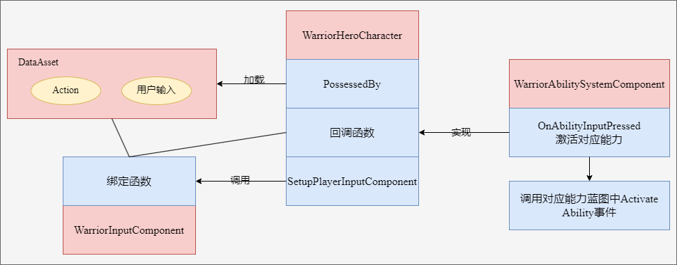

# Warrior

## Melee Combo System

  
Lesson list

  

  

    
### 3-5 Hero Hero Gameplay Ability

  

    
> 本节主要内容是在以下两个文件中创建辅助函数（查找角色、控制器、组件等），以供蓝图调用
> - WarriorGameplayAbility
> - WarriorHeroGameplayAbility
  

  

    
### 3-6 Ability Input Action

   

  
> 本节课主要是重复了Input Binding流程的前三个流程
> 
>> 全流程：Native Gameplay Tags -> Input Config Data Asset -> Custom Input Component -> Binding Inputs -> Assign Assets in Editor
>
> Native Gameplay Tags: 声明及定义GameplayTag
> 
> Input Cofig Data Asset: 创建了一个新的数组存储AbilityInputAction
> 
> Custome Input Component: 为绑定action创建了模板函数

  

    
### 3-7 Hero Ability Set

  

> Hero Character需要把标签传给Ablity System Component，通过标签激活对应的Ability，因此在UDataAsset_HeroStartUpData类里创建了一个结构体，维护标签与ability的关系，并重写了将能力赋予ASC的方法，这样在WarriorHeroCharacter的PossessedBy函数中就会调用子类的GiveToAbilitySystemComponent方法。

  

    
### 3-8 Binding Ability Input

  

  
> 在Input Component中将Ability与tag绑定，在Hero Character中，调用绑定方法并定义回调函数，回调函数负责触发技能。

  

    
### 3-10 Wait for Gameplay Event

  

  
> 这两节课主要是创建动画，创建了动画通知用的蓝图，传递标签，并定义了新的标签，供发送通知时使用。（标签主要是用来识别武器的）

  

    
### 3-13 Link Anim Layer

  

  
> 不同的武器会有不同的动画，为了避免创建复杂的动画图表，采用了分层的概念创建动画。

  

    
### 3-14 Default Weapon Ability

  

  
> 设置了能力蓝图中，能力标签对其他标签的屏蔽。
> 
> 角色在装备武器时，要链接动画图层，有不同的能力：卸下装备，轻攻击，重攻击等，重新绑定输入映射上下文。
> 
> 角色在卸下装备时，需要卸载动画图层，移除授予的能力，移除输入映射等。
> 
> 这些跟武器相关，所以将这些内容维护在AWarriorHeroWeapon类中，简而言之，我们在捡起武器的同时，也捡起了一套“系统”。

  

    
### 3-15 Grant Weapon Ability

  

  
> UWarriorAbilitySystemComponent类里添加了GrantHeroWeaponAbilities方法，根据武器关联的能力进行授予。
>
> 设置蓝图。
>
> （不知道为什么少了3-14节的几个资源，已补充）

  

    
### 3-16 Handle Unequip Axe

  

  
> 卸载武器时，需要unlinke anim class layers，删除mapping context以及清空授权的能力。
>
> UWarriorAbilitySystemComponent负责授权能力以及移除授权能力，已授权的FGameplayAbilitySpecHandle被保存在武器类中。
>
> 补充了3-15结尾遗留部分代码。

  

    
### Stop & Summarize

  

  
> 前面这部分主要内容是围绕着输入-技能展开的，抛开动画暂且不论，仅输入-技能而言，大概逻辑是mapping context将action与input tag对应起来，而mapping context被存储在data asset中；input component中定义了绑定函数，将action，tag与回调函数进行关联，hero character的possesedby函数加载data asset，setupplayerinputcomponent中则启用了input component中的绑定函数，回调函数也在hero character中被定义，但其真正的实现OnAbilityInputPressed则在WarriorAbilitySystemComponent中，该函数根据标签遍历可激活的技能列表（GetActivatableAbilities()返回的是【可激活】的技能，可激活也就是被授予的技能，区别于【已激活】），如果标签匹配则激活对应技能TryActivateAbility，此时会触发对应蓝图中Activate Ability事件，执行后续逻辑，比如播放montage，设置anim class layer，mapping context，授予能力等等。
> 
  

  

### 3-17 Light Attack Ability

  

>讲解了轻攻击能力的配置流程，前面框架搭好以后，流程就是：
>
>定义tag -> 创建action -> Input config中将input tag与action绑定 -> 修改mapping context，将aciton与输入进行映射 -> 创建能力蓝图，设置标签 -> 在武器中修改weapon data，配置input tag与ability
>
>注意：能力蓝图中设置的是ability tag，而其他地方没有记错的话设置的是input tag，Weapon data中将input tag与能力蓝图绑定，也就与ability tag进行了关联。

### 3-18 Combo Logic

> 本节重点是在GA_Hero_LightAttackMaster中创建了连击的逻辑，连续攻击增加计数，超过一定时间进行重置。
> 
> GA_Hero_LightAttack_Axe中则维护了montage的映射。
>
> 注意，montage中的slot可以视作一个“动画播放通道”，以控制不同部位的动画。

### 3-20 Heavy Attack Logic

> 本节与上一节的内容同轻攻击。
  

### 3-21 Warrior Function Library

> 因为连击系统与动画是独立的，现在需要实现这样的功能：轻击3之后可以直接跳转到重击2，就需要进行通信。
>
> 本节创建了一个函数库以供后续使用，比如获取ASC组件，添加标签，移除标签，检测actor是否有标签等。
  

### 3-22 Jump To Finisher
  

> 在轻击和重击的功能蓝图中进行了轻击3->重击2的功能实现，主要思路就是通过Ability System Component添加标签，以识别能否进行跳转。
  

### 3-23 Slow Motion and Sound FX
  

> 基于AnimNotifyState类创建蓝图，重载函数以控制时间流速。
>
> 给montage添加慢动作及音效。
  

### Bug Fixed
  

> 上一节重击1的montage未保存。
>
> 修理了几处bug：之前定义event.unequip.axe标签时多打了空格，修复后导致人物不能正常收回武器，需要在收回武器的能力蓝图和montage中重新选择标签。

### 3-24 Section Wrap Up
  

> 注释调试代码，在FWarriorHeroAbilitySet这个结构体中，AbilityToGrant的类型换为更具体的子类UWarriorHeroGameplayAbility，删除部分无用资源。

## Hero Combat

  
Lesson list

### 4-3 Set Up Enemy Character
  

> 前期准备，创建Enemy的C++类：character，startup data，gameplay ability，combat component。

### 4-4 Gruntling Guardian
  

> 创建动画蓝图，在创建模板动画蓝图的时候，并不需要指定骨骼。

  

